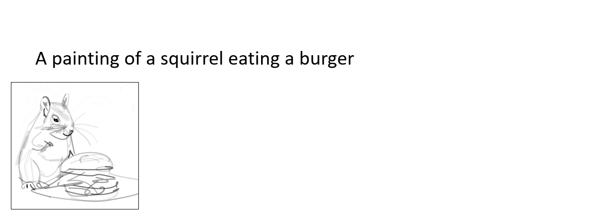

# Text-based Vector Sketch Editing with Image Editing Diffusion Prior (ICME 2024)

[[Paper]](https://www.sysu-imsl.com/files/ICME2024/ICME2024_sketch_editing_final.pdf)

This code is used for editing vector sketches with text prompts.

