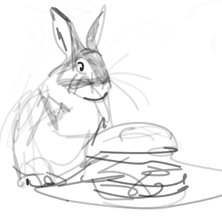
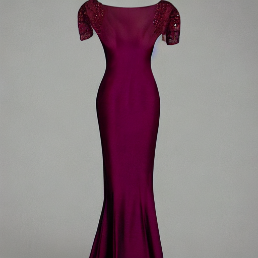

# Text-based Vector Sketch Editing with Image Editing Diffusion Prior (ICME 2024)

[[Paper]](https://www.sysu-imsl.com/files/ICME2024/ICME2024_sketch_editing_final.pdf)

This code is used for editing vector sketches with text prompts.


## Outline
- [Installation](#installation)
- [Quick Start](#quick-start)
- [Citation](#citation)

## Installation

1. Please follow instructions in [ximinng/DiffSketcher](https://github.com/ximinng/DiffSketcher?tab=readme-ov-file#step-by-step) for the step-by-step environment preparation.
2. Download the [CompVis/stable-diffusion-v1-4](https://huggingface.co/CompVis/stable-diffusion-v1-4/tree/main) models and place them somewhere. Follow file structure [here](https://github.com/MarkMoHR/DiffSketchEdit/tree/main/StableDiffusionModels/CompVis/stable-diffusion-v1-4).
3. Finally, modify the directory path of your downloaded models to `huggingface_model_dict["sd14"]`([Line 11](https://github.com/MarkMoHR/DiffSketchEdit/blob/main/methods/diffusers_warp/__init__.py#L11)) of `./methods/diffusers_warp/__init__.py`.

## Quick Start

Use the code `run_painterly_render.py` and scroll to [Line 81](https://github.com/MarkMoHR/DiffSketchEdit/blob/main/run_painterly_render.py#L81). Then, modify the code according to the following instructions:

1. Set one or more seeds, or choose random ones.
2. Choose the editing type. `replace`, `refine` and `reweight` stand for editing modes Word Swap, Prompt Refinement and Attention Re-weighting, respectively.
3. Set the prompt information.

### Examples

(a) Word Swap (`replace`)

```
seeds_list = [25760]
args.edit_type = "replace"

PromptInfo(prompts=["A painting of a squirrel eating a burger",
                    "A painting of a rabbit eating a burger",
                    "A painting of a rabbit eating a pumpkin",
                    "A painting of a owl eating a pumpkin"],
           token_ind=5,
           changing_region_words=[["", ""], ["squirrel", "rabbit"], ["burger", "pumpkin"], ["rabbit", "owl"]])
```

- `token_ind`: indicate the index of cross-attn maps for initializing strokes.
- `changing_region_words`: for local editing. Type in two words to indicate the changing regions during each edit. Use empty strings for the first edit.


| Original image and sketch | Edited image and sketch 1 | Edited image and sketch 2 | Edited image and sketch 3 | 
|:-------------:|:-------------------:|:----------------------:|:--------:|
|  |  |  |  |
|  |  |  |  |

(b) Prompt Refinement (`refine`)

```
seeds_list = [53487]
args.edit_type = "refine"

PromptInfo(prompts=["An evening dress",
                    "An evening dress with sleeves",
                    "An evening dress with sleeves and a belt"],
           token_ind=3,
           changing_region_words=[["", ""], ["", "sleeves"], ["", "belt"]]),
```

- `changing_region_words`: set an empty string for the first words.

| Original image and sketch | Edited image and sketch 1 | Edited image and sketch 2 |
|:-------------:|:-------------------:|:----------------------:|
|  |  |  |
|  |  |  |


(c) Attention Re-weighting (`reweight`)

```
seeds_list = [35491]
args.edit_type = "reweight"

PromptInfo(prompts=["An emoji face with moustache and smile"] * 3,
           token_ind=3,
           changing_region_words=[["", ""], ["moustache", "moustache"], ["smile", "smile"]],
           reweight_word=["moustache", "smile"],
           reweight_weight=[-1.0, 3.0]),
```

- `changing_region_words`: set the same words for each pair.
- `reweight_word` / `reweight_weight`: word or weight for reweighting at each edit.


| Original image and sketch | Edited image and sketch 1 | Edited image and sketch 2 |
|:-------------:|:-------------------:|:----------------------:|
|  |  |  |
|  |  |  |


## Acknowledgement

The project is built upon [ximinng/DiffSketcher](https://github.com/ximinng/DiffSketcher) and [google/prompt-to-prompt](https://github.com/google/prompt-to-prompt). We thank all the authors for their effort.

## Citation

If you use the code please cite:

```
@inproceedings{mo2024text,
  title={Text-based Vector Sketch Editing with Image Editing Diffusion Prior},
  author={Mo, Haoran and Lin, Xusheng and Gao, Chengying and Wang, Ruomei},
  booktitle={2024 IEEE International Conference on Multimedia and Expo (ICME)},
  pages={1--6},
  year={2024},
  organization={IEEE}
}
```

